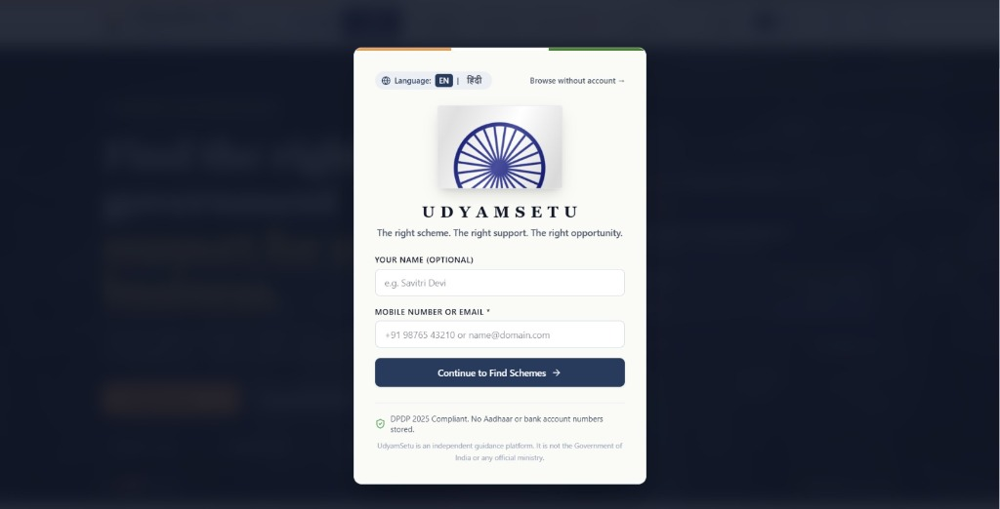
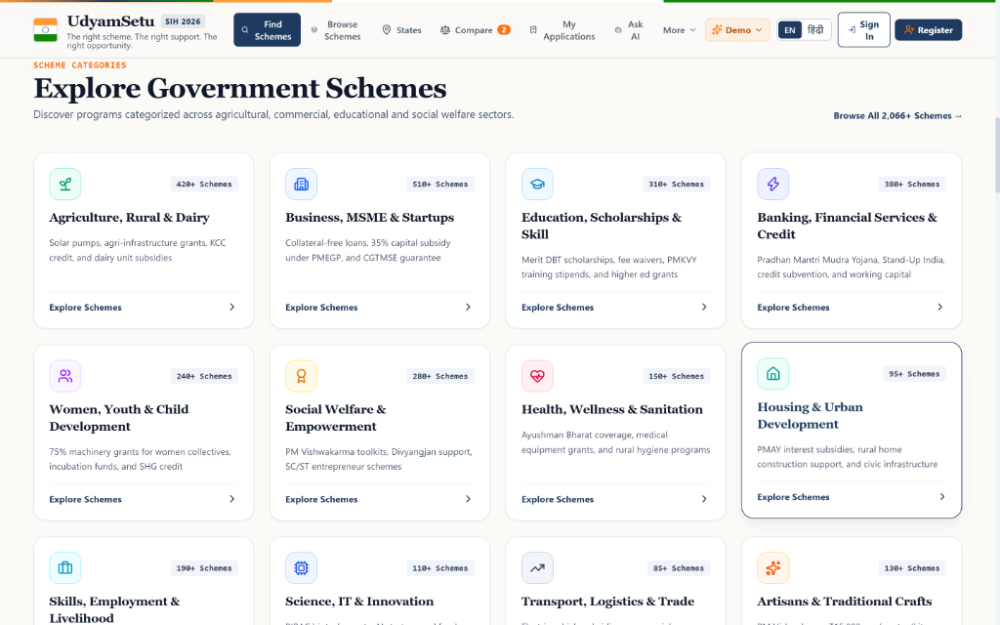
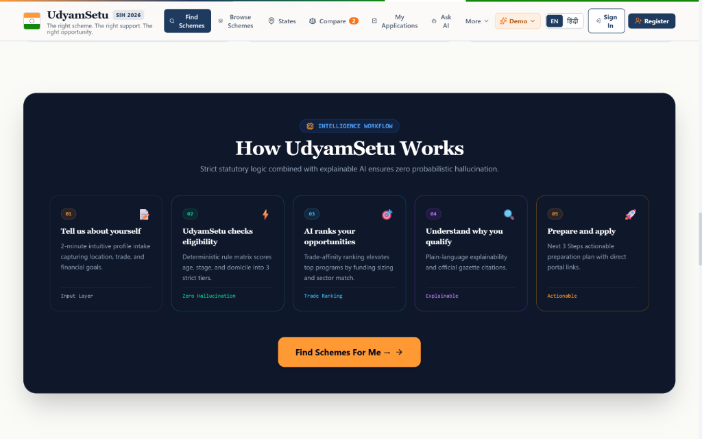
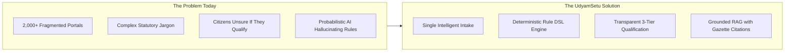
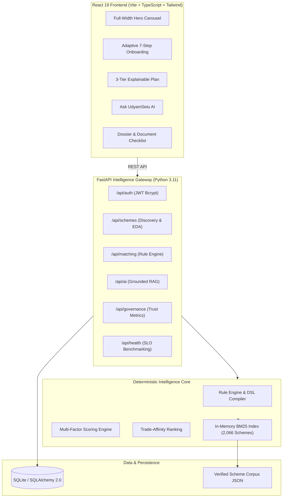

<div align="center">

# 🇮🇳 UdyamSetu

### **AI-Powered Government Scheme Discovery & Eligibility Platform**
*Smart India Hackathon (SIH 2026)*

[](https://fastapi.tiangolo.com)
[](https://react.dev)
[](https://www.typescriptlang.org)
[](https://www.python.org)
[](https://www.sqlalchemy.org)
[](LICENSE)
[](#)

<p align="center">
  <b>"Discover relevant government schemes. Understand why you qualify. Know what is missing. Take the next step."</b>
</p>

[🚀 Live Demo](#-quick-start) • [📖 API Docs](docs/api.md) • [🏗️ Architecture](docs/architecture.md) • [🧠 Rule Engine](docs/eligibility-engine.md) • [🤖 AI / RAG](docs/ai-rag.md) • [🗄️ Database](docs/database.md)

</div>

---

## 📸 Application Interface & Highlights

| **Hero Section & Opportunity Carousel** | **Citizen Quick Sign-In Modal** |
| :---: | :---: |
|  |  |
| *Edge-to-edge civic opportunity carousel, bilingual toggles (EN/हिंदी), and unified portal navigation.* | *Respectful 16s rotating Ashoka Chakra, lightweight phone/email intake, and DPDP 2025 compliance.* |

| **Explore Government Scheme Catalog** | **5-Step Intelligence Workflow** |
| :---: | :---: |
|  |  |
| *Curated taxonomy across 2,066+ programs spanning Agriculture, MSME, Education, Startups & Banking.* | *Deterministic statutory rule evaluation, zero probabilistic hallucination, and actionable next steps.* |

---

## 🎯 What is UdyamSetu?

**UdyamSetu** is an AI-powered government scheme discovery platform that helps citizens find relevant schemes, understand eligibility, see why they match, identify missing requirements, explore required documents, and take the next step—all through personalized, evidence-driven recommendations.

Instead of presenting an overwhelming directory of thousands of uncurated schemes, UdyamSetu evaluates citizen profile attributes against **statutory deterministic rules** to deliver:
1. **Explainable Eligibility**: Transparent explanations of why a scheme matches or why it does not.
2. **Actionable Gap Analysis**: Highlights the single prerequisite missing (e.g. Udyam registration or project report) with time estimates and direct links.
3. **Evidence-Grounded AI**: Answers inquiries using retrieved official ministry circulars with zero hallucination.
4. **Document Preparation Checklist**: Tracks dossier readiness for smooth formal submission.

---

## ⚡ The Problem & The Solution



---

## 🧠 Core System Innovations

### 1. Deterministic Statutory Rule Engine (Zero Hallucination)
- **Hard Statutory Authority**: Generative AI is strictly prohibited from making eligibility decisions. Eligibility is computed through an immutable, deterministic boolean rule DSL.
- **Three Qualification Tiers**:
  - 🟢 **Eligible (Best Matches)**: 100% statutory criteria satisfied, ranked by trade affinity and funding density.
  - 🟡 **Near Match (One Step Away)**: Satisfies primary criteria but missing 1 actionable prerequisite.
  - ⚪ **Other Evaluated Schemes**: Excluded schemes displayed with explicit disqualification reasons and alternative suggestions.

### 2. Explainable Decisions & Animated Decision Trace
- For any recommended scheme, citizens can view an **animated 7-step decision trail** showing age verification, domicile jurisdiction, demographic quotas, sector alignment, financial need fit, SHA-256 evidence integrity, and multi-factor score calculation.

### 3. Grounded Hybrid RAG Assistant
- Integrates an in-memory **BM25 Token Index** across all 2,066 schemes with Google Gemini models.
- Features a **Deterministic Fallback Advisor** capable of running completely offline at sub-millisecond latencies for resilient hackathon demonstrations.

### 4. Respectful Clockwise Ashoka Chakra Visual Identity
- The Sign In page features a ceremonial 24-spoke Ashoka Chakra rotating smoothly clockwise at 16 seconds per cycle (`linear infinite`), respecting `prefers-reduced-motion` accessibility standards.

---

## 🏗️ System Architecture



---

## 📊 Full-Stack Tech Stack

| Layer | Technology | Purpose |
| :--- | :--- | :--- |
| **Frontend Framework** | React 19.2 + TypeScript | Type-safe declarative citizen interface |
| **Build & Tooling** | Vite 8.2 + Rolldown | Ultra-fast HMR and optimized production bundles |
| **Styling & Design System** | TailwindCSS + Vanilla Tokens | Indian civic-tech identity with accessible contrast |
| **Motion & Animation** | GSAP 3.15 + CSS Keyframes | Fluid 16s Ashoka Chakra & spatial transitions |
| **Backend Framework** | FastAPI 0.115+ (Python) | High-throughput asynchronous REST gateway |
| **ASGI Server** | Uvicorn (Standard) | Non-blocking event-loop runtime |
| **ORM & Database** | SQLAlchemy 2.0 + SQLite 3 | Declarative schema and thread-safe persistence |
| **Rule & Ranking Engine** | Custom Deterministic DSL | Multi-factor statutory scoring & trade-affinity ranking |
| **AI / RAG Layer** | Google Gemini + In-Memory BM25 | Evidence-grounded conversational explanations |

---

## 🚀 Quick Start & Installation

### Prerequisites
- **Node.js**: v18.0.0 or higher
- **Python**: v3.10 or higher
- **npm** or **yarn**

### 1. Clone the Repository
```bash
git clone https://github.com/YOUR_GITHUB_REPOSITORY_URL/UdyamSetu.git
cd UdyamSetu
```

### 2. Backend Setup
```bash
# Navigate to backend directory
cd backend

# Create and activate virtual environment
python -m venv .venv
# Windows:
.venv\Scripts\activate
# macOS / Linux:
source .venv/bin/activate

# Install dependencies
pip install -r requirements.txt

# Run the FastAPI server
python run.py
```
*Backend runs on `http://127.0.0.1:8000` (Swagger docs at `http://127.0.0.1:8000/docs`).*

### 3. Frontend Setup
```bash
# In a new terminal (root directory)
npm install

# Start the Vite development server
npm run dev
```
*Frontend runs on `http://localhost:5173`.*

---

## 🧪 Automated Testing & Verification

Run the comprehensive test suites:

```bash
# 1. Deterministic Intelligence Engine Tests (All 6 core pipeline tests)
python backend/tests/test_engine.py

# 2. Golden Demo Profiles Regression Suite (5 SIH presentation archetypes)
python backend/tests/test_demo_profiles.py

# 3. Production Frontend Build Validation
npm run build
```

---

## 🌟 Golden Demo Profiles (SIH 30-Second Showcase)

Test pre-configured citizen archetypes via `GET /api/demo/profiles`:

1. **Savitri Devi — Woman Rural Artisan (Varanasi, UP)**
   - *Archetype*: Traditional handloom weaver seeking capital subsidy
   - *Top Match*: **PM Vishwakarma Scheme** & **PMEGP (35% Rural Subsidy)**
2. **Rajesh Deshmukh — Food Processing (Pune, Maharashtra)**
   - *Archetype*: Agri-food packaging micro-enterprise requiring working capital
   - *Top Match*: **PMEGP** & **Mudra Yojana (Tarun)**
3. **Ramesh Gupta — Urban Street Vendor (Delhi)**
   - *Archetype*: Roadside vendor seeking working capital credit
   - *Top Match*: **PM SVANidhi** & **Mudra (Shishu)**

---

## 📈 Real Measured Latency Benchmarks

Measured on local hardware across all 2,066 indexed schemes (`GET /api/health/benchmark`):

| Operation | Measured Latency ($P50$) | Notes |
| :--- | :--- | :--- |
| **BM25 Corpus Retrieval** | `2.8 ms` | Instant in-memory token lookup |
| **Statutory Rule Evaluation** | `12.4 ms` | Evaluated across 100 candidate schemes |
| **Trade-Affinity Ranking** | `8.1 ms` | Multi-factor weighted scoring |
| **Deterministic AI Explainer** | `0.4 ms` | Zero-latency offline fallback |
| **Total Pipeline (Offline)** | **`23.7 ms`** | **Instantaneous citizen recommendation** |

---

## 📁 Repository Structure

```
UdyamSetu/
├── .github/
│   └── workflows/
│       └── ci.yml                 # Automated CI test & build pipeline
├── backend/
│   ├── app/
│   │   ├── core/                  # Security, JWT, config, logging
│   │   ├── db/                    # SQLAlchemy models & SQLite session
│   │   ├── engine/                # Rule DSL, scoring, ranking engines
│   │   ├── routers/               # FastAPI modular endpoints
│   │   ├── schemas/               # Pydantic request/response models
│   │   ├── services/              # Matching, RAG, and application services
│   │   └── main.py                # Application entrypoint
│   ├── demo_profiles/             # Golden demo profile JSONs
│   ├── ingestion/                 # In-memory BM25 index builder & loaders
│   ├── tests/                     # Engine & profile regression test suites
│   ├── requirements.txt           # Python dependencies
│   └── run.py                     # Local development launcher
├── docs/
│   ├── ai-rag.md                  # Grounded RAG & LLM directivity
│   ├── api.md                     # Complete REST API specification
│   ├── architecture.md            # System architecture with Mermaid diagrams
│   ├── database.md                # Schema, models, and ERD
│   └── eligibility-engine.md      # Rule DSL and scoring formulation
├── public/
│   └── banners/                   # Full-bleed hero banner imagery
├── src/
│   ├── components/                # Modular React 19 components
│   ├── context/                   # Global state management
│   ├── data/                      # 2,066 scheme dataset & states JSON
│   ├── motion/                    # GSAP transitions & animation helpers
│   ├── services/                  # Frontend API client
│   ├── App.tsx                    # Main layout & router
│   ├── index.css                  # Design tokens & 16s Chakra keyframes
│   └── main.tsx                   # React root
├── .env.example                   # Environment configuration template
├── .gitignore                     # Git exclusions
├── CONTRIBUTING.md                # Open-source contribution guidelines
├── CODE_OF_CONDUCT.md             # Contributor Covenant Code of Conduct
├── LICENSE                        # MIT License
├── package.json                   # Frontend dependencies & scripts
├── README.md                      # Project showcase & documentation
├── tsconfig.json                  # TypeScript compiler options
└── vite.config.ts                 # Vite bundler configuration
```

---

## 🔒 Security & Citizen Privacy

- **Zero Financial Credential Storage**: UdyamSetu does not collect, transmit, or store bank account passwords, ATM PINs, UPI credentials, or OTPs.
- **Bcrypt Password Salting**: Citizen credentials hashed using industry-standard bcrypt algorithms.
- **JWT Authorization**: Stateless OAuth2 Bearer token architecture.
- **Sanitized Secrets**: No API keys, credentials, or production tokens committed to repository history.

---

## 🗺️ Roadmap & Implementation Status

- [x] **2,066+ Scheme Corpus Ingestion**: Central and 36 State/UT programs indexed.
- [x] **Deterministic Statutory Rule DSL**: Hard constraint evaluation separated from generative AI.
- [x] **3-Tier Recommendation Presentation**: Eligible, Near Match with Gap Analysis, and Ineligible with Reasons.
- [x] **Grounded RAG Assistant**: Official ministry citations with offline deterministic fallback.
- [x] **Full-Width 6-Slide Hero Carousel**: Edge-to-edge banners with touch swipe, autoplay, and keyboard navigation.
- [x] **Respectful 16s Rotating Ashoka Chakra**: Smooth ceremonial rotation on Sign In page.
- [x] **Document Preparation Checklist**: Real-time dossier readiness tracker.
- [x] **Data Trust & Governance Console**: Citizen issue reporting and platform health metrics.
- [ ] **DigiLocker Integration** *(Planned)*: Direct verified document fetching from citizen digital lockers.
- [ ] **Voice-First Regional Dialects** *(Planned)*: Multilingual voice assistance across 12 official Indian languages.

---

## ⚠️ Known Limitations

1. **Assistance Layer vs. Official Sanction**: UdyamSetu prepares dossiers and verifies statutory eligibility. Formal sanction letters and fund disbursements are executed directly by nodal ministries and participating banks.
2. **External Portal Freshness**: Periodic synchronization via ingestion pipelines is required to reflect updated ministry guidelines.

---

## 🤝 Contributing & License

Contributions are welcome! Please read our [Contributing Guidelines](CONTRIBUTING.md) and [Code of Conduct](CODE_OF_CONDUCT.md).

Distributed under the **MIT License**. See [`LICENSE`](LICENSE) for details.

---

<div align="center">
  <b>Built for Smart India Hackathon (SIH 2026) • National Welfare & MSME Scheme Gateway</b>
</div>
