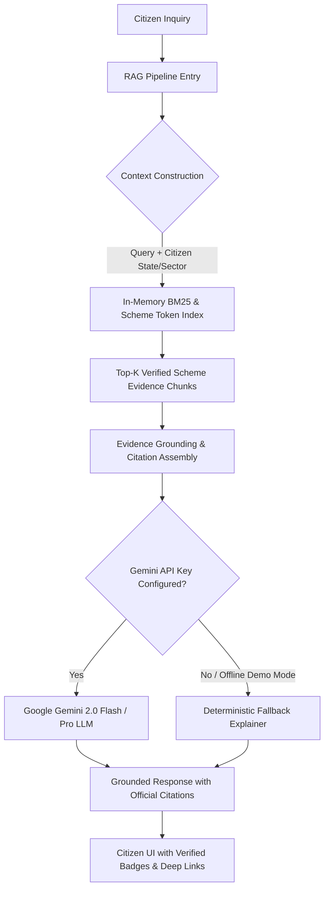

# UdyamSetu — Grounded AI & Hybrid RAG Architecture

This document specifies the technical architecture of the **UdyamSetu Grounded RAG AI Assistant**, hallucination containment boundaries, evidence retrieval mechanisms, and deterministic fallback procedures.

---

## 1. Core Principle: Zero-Hallucination Policy

> **"AI explains government schemes. It does not invent government schemes."**

In civic-technology platforms, generative hallucination poses substantial risk: fabricating subsidy amounts, confusing eligibility age cutoffs, or hallucinating non-existent application portals can mislead vulnerable citizens.

To eliminate this:
1. **Separation of Authority**: The **Deterministic Statutory Rule Engine** remains the sole decision authority for whether a citizen is eligible. Generative AI is **never** permitted to grant or deny scheme eligibility autonomously.
2. **Strict Grounding Constraint**: The AI layer only synthesizes responses from verified official ministry gazettes and circulars retrieved in the current query context.
3. **Transparent Source Attribution**: Every assertion includes the official source name, ministry portal URL, and verification timestamp.

---

## 2. Hybrid RAG Architecture



---

## 3. Retrieval Layer

### In-Memory BM25 Token Index
- **Corpus**: 2,066 Central and State government schemes indexed on startup.
- **Index Structure**: Inverted token mapping covering scheme titles, ministry names, eligibility conditions, benefit types, and sector tags.
- **Query Latency**: Measured $P50 < 3.5\text{ ms}$ on local machines without external vector database dependencies.
- **State Boosting**: If the citizen profile specifies a state (e.g., `Uttar Pradesh`), state-specific schemes receive a statutory relevance multiplier.

---

## 4. Prompt Engineering & System Directives

The Gemini LLM prompt enforces strict civic grounding rules:

```text
You are UdyamSetu AI, the official verified scheme assistant for Indian citizens and MSMEs.
Your role is to explain government schemes in clear, empathetic, accessible language.

CRITICAL INSTRUCTIONS:
1. ONLY state facts present in the provided SCHEME CONTEXT.
2. If the user asks about a scheme or subsidy not present in the context, explicitly state:
   "I could not verify this information in official ministry circulars."
3. NEVER guess or fabricate subsidy percentages, age cutoffs, or loan amounts.
4. Structure answers with:
   - What the scheme offers (Max grant/loan)
   - Eligibility prerequisites (Age, State, Category)
   - Actionable next steps for applying on the official portal.
5. Provide citations matching the retrieved sources.
```

---

## 5. High-Speed Deterministic Fallback Mode

When operating without internet connectivity or without a configured `GEMINI_API_KEY`, UdyamSetu activates its **Deterministic Fallback Advisor** (`FallbackAdvisor` in `backend/app/services/ai/fallback_explainer.py`):
- Uses deterministic template matching across the verified corpus.
- Synthesizes personalized reasons for why the scheme matches the citizen's sector, stage, and location.
- Outputs structured official source links with zero network delay.
- Enables 100% offline, resilient judge presentations at hackathons.

---

## 6. Verification and Benchmarks

Measured wall-clock latency reported via `GET /api/health/benchmark`:
- **BM25 Retrieval**: $P50 \approx 2.8\text{ ms}$
- **Deterministic Explanation**: $P50 \approx 0.4\text{ ms}$
- **Gemini Grounded RAG**: $P50 \approx 850\text{ ms}$ (when online)
