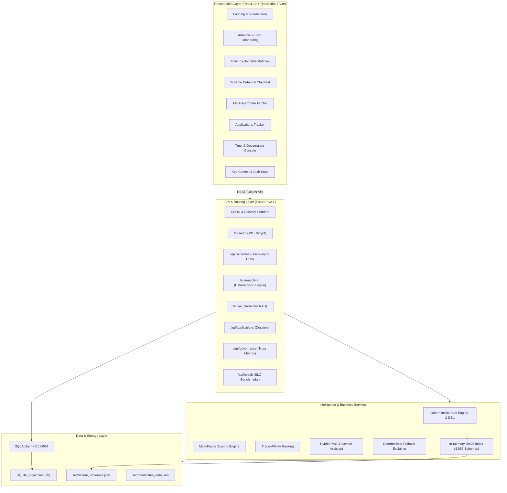

# UdyamSetu — Full-Stack Architecture & Engineering Specification

This document provides the high-level system architecture, component relationships, data flow, and runtime boundaries of the **UdyamSetu Platform**.

---

## 1. System Architecture Diagram

---

## 2. Component Structure

### 2.1 Frontend (`src/`)
- **`components/`**:
  - `HeroCarousel.tsx`: Edge-to-edge 6-slide civic-tech hero with right-to-left transition, autoplay, pause-on-hover, and keyboard navigation.
  - `LoginPage.tsx`: Split-pane authentication featuring continuous clockwise rotating Ashoka Chakra (16s cycle).
  - `RegisterPage.tsx`: Multi-step adaptive onboarding wizard with progressive disclosure.
  - `MatchingWizard.tsx`: Interactive demographic & MSME questionnaire.
  - `MatchResultsView.tsx`: 3-tier recommendation dashboard with "Why this scheme" signals and animated decision traces.
  - `SchemeDetailView.tsx`: Complete statutory scheme breakdown with interactive document readiness checklist.
  - `AskUdyamSetuAI.tsx`: Grounded RAG conversation interface with source citations.
  - `ApplicationsDashboard.tsx`: Document preparation dossier tracker.
  - `ProfileView.tsx`: Citizen profile management with real-time completeness gauge.
  - `BrowseSchemesView.tsx`: 2,066 scheme searchable and filterable directory.
  - `IndiaStateExplorer.tsx`: State & Union Territory localized subsidy explorer.
  - `SchemeCompareView.tsx`: Side-by-side scheme comparison matrix.
  - `AdminGovernanceView.tsx` & `TrustCenterView.tsx`: Platform data trust and SLO governance.
- **`context/`**:
  - `AppContext.tsx`: Central state management for user authentication, profile data, matching results, and saved applications.
- **`services/`**:
  - `api.ts`: Typed client for all backend REST endpoints.
  - `matchingEngine.ts`: Client-side fallback matching engine for instant offline operation.

---

### 2.2 Backend (`backend/`)
- **`app/main.py`**: FastAPI entrypoint with lifespan event handler initializing DB tables and warming up the scheme index.
- **`app/routers/`**: Modular endpoint routers (`auth`, `schemes`, `matching`, `ai`, `applications`, `governance`, `udyam`, `health`, `demo`).
- **`app/db/`**:
  - `database.py`: SQLAlchemy session generator.
  - `models.py`: Declarative ORM models (`User`, `UserProfile`, `SavedApplication`, `IssueReport`, `RecommendationHistory`, `AuditLog`).
- **`app/engine/`**:
  - `rule_engine.py`: Statutory constraint evaluator.
  - `scoring_engine.py`: Multi-factor relevance calculator.
  - `ranking_engine.py`: Trade-affinity sorter.
  - `explanation_engine.py`: Transparent step-by-step decision generator.
- **`app/services/`**:
  - `matching_service.py`: Pipeline coordinator.
  - `rag_service.py`: Google Gemini and BM25 grounded retrieval.
  - `application_service.py`: Dossier and checklist persistence.
  - `analytics_service.py`: Governance telemetry.
- **`ingestion/`**:
  - `index_builder.py`: In-memory BM25 index with singleton caching.
  - `scheme_loader.py`: Raw scheme JSON normalizer and validator.

---

## 3. Data Flow: From Discovery to Application

1. **Citizen Onboarding / Intake**: The citizen provides profile attributes (Age, Location, Trade, Stage, Goals).
2. **Deterministic Evaluation**: The backend runs the profile against all 2,066 indexed schemes via statutory rule evaluation.
3. **Multi-Factor Ranking**: Schemes passing statutory constraints are ranked by trade affinity, capital subsidy percentage, and requested financial support.
4. **Explainable Presentation**: The citizen reviews their personalized plan categorized into **Eligible (Best Matches)** and **Near Match (One Step Away)** with explicit gap analysis.
5. **Document Checklist**: On the scheme detail page, the citizen checks off prepared documents (e.g. Aadhaar, Project Report, Udyam Certificate) to measure application readiness.
6. **Official Submission**: The citizen proceeds directly to the official government portal (`kviconline.gov.in`, `pmvishwakarma.gov.in`, `jansamarth.in`) to submit the formal application.
