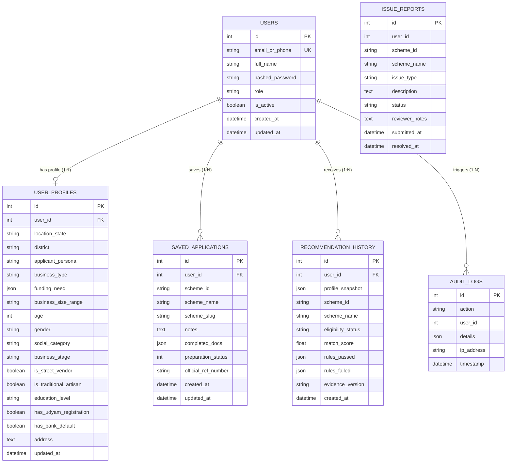

# UdyamSetu — Database Architecture & Schema Specification

This document details the relational database schema, ORM mappings, relationships, indexing strategies, and lifecycle management for **UdyamSetu**.

---

## 1. Overview & Engine Configuration

- **Database Engine**: SQLite 3 (Default, in-memory capable for zero-latency SIH evaluation) / PostgreSQL compatible
- **ORM**: SQLAlchemy 2.0+ Declarative Mapping
- **Connection Management**: Pooled thread-safe session generator (`get_db`)
- **Schema Auto-Migration**: Automatic table initialization on startup via `Base.metadata.create_all(bind=engine)`

---

## 2. Entity Relationship Diagram (ERD)



---

## 3. Detailed Model Specifications

### 3.1. `users` Table
Stores authentication credentials and top-level citizen authorization.

| Column | Type | Constraints | Description |
| :--- | :--- | :--- | :--- |
| `id` | `INTEGER` | `PRIMARY KEY, AUTOINCREMENT, INDEX` | Unique user identifier |
| `email_or_phone` | `VARCHAR(120)` | `UNIQUE, INDEX, NOT NULL` | Login identifier (Email or +91 phone) |
| `full_name` | `VARCHAR(120)` | `NOT NULL, DEFAULT 'Entrepreneur'` | Citizen's full name |
| `hashed_password` | `VARCHAR(255)` | `NOT NULL` | Bcrypt salt & hashed password |
| `role` | `VARCHAR(50)` | `DEFAULT 'user'` | Access control tier (`user` \| `admin`) |
| `is_active` | `BOOLEAN` | `DEFAULT TRUE` | Soft-deletion and activation flag |
| `created_at` | `DATETIME` | `DEFAULT UTC NOW` | Account creation timestamp |
| `updated_at` | `DATETIME` | `ON UPDATE UTC NOW` | Last modification timestamp |

---

### 3.2. `user_profiles` Table
Contains structured citizen demographic and MSME enterprise attributes utilized by the deterministic rule engine.

| Column | Type | Constraints | Description |
| :--- | :--- | :--- | :--- |
| `id` | `INTEGER` | `PRIMARY KEY, AUTOINCREMENT, INDEX` | Profile record ID |
| `user_id` | `INTEGER` | `FOREIGN KEY (users.id), INDEX` | Associated citizen account |
| `location_state` | `VARCHAR(100)` | `NOT NULL, DEFAULT 'Uttar Pradesh'` | Citizen domicile state/UT |
| `district` | `VARCHAR(100)` | `DEFAULT 'Varanasi'` | Operating district |
| `applicant_persona` | `VARCHAR(100)` | `DEFAULT 'starting_business'` | Citizen archetype (`artisan`, `farmer`, `student`, etc.) |
| `business_type` | `VARCHAR(100)` | `DEFAULT 'Textile'` | Primary industry / trade sector |
| `funding_need` | `JSON` | `DEFAULT list` | Multi-select needs (`["Loan", "Subsidy", "Machinery"]`) |
| `business_size_range`| `VARCHAR(100)` | `DEFAULT 'micro_under_10l'` | Annual turnover / project scale bracket |
| `age` | `INTEGER` | `DEFAULT 28` | Citizen age in years |
| `gender` | `VARCHAR(50)` | `DEFAULT 'female'` | Gender identity for quota scoring |
| `social_category` | `VARCHAR(50)` | `DEFAULT 'OBC'` | Caste / Social bracket (`General`, `OBC`, `SC`, `ST`, `EWS`) |
| `business_stage` | `VARCHAR(50)` | `DEFAULT 'new'` | `new` (greenfield) or `existing` (expansion) |
| `is_street_vendor` | `BOOLEAN` | `DEFAULT FALSE` | Flag for PM SVANidhi qualification |
| `is_traditional_artisan`| `BOOLEAN` | `DEFAULT TRUE` | Flag for PM Vishwakarma qualification |
| `education_level` | `VARCHAR(50)` | `DEFAULT '10th'` | Highest educational attainment |
| `has_udyam_registration`| `BOOLEAN` | `DEFAULT FALSE` | Official MSME registration flag |
| `has_bank_default` | `BOOLEAN` | `DEFAULT FALSE` | Credit history flag |
| `address` | `TEXT` | `NULLABLE` | Local residential or commercial address |

---

### 3.3. `saved_applications` Table
Tracks citizen document preparation workflows, checklist completion, and personal notes.

| Column | Type | Constraints | Description |
| :--- | :--- | :--- | :--- |
| `id` | `INTEGER` | `PRIMARY KEY, AUTOINCREMENT, INDEX` | Saved application ID |
| `user_id` | `INTEGER` | `FOREIGN KEY (users.id), INDEX` | Citizen owner |
| `scheme_id` | `VARCHAR(100)` | `INDEX, NOT NULL` | Target scheme identifier |
| `scheme_name` | `VARCHAR(255)` | `NOT NULL` | Full title of government scheme |
| `scheme_slug` | `VARCHAR(150)` | `NULLABLE` | URL-friendly unique slug |
| `notes` | `TEXT` | `DEFAULT '...'` | Citizen's private notes & meeting logs |
| `completed_docs` | `JSON` | `DEFAULT list` | List of checked document IDs (`["doc-1", "doc-aadhaar"]`) |
| `preparation_status` | `INTEGER` | `DEFAULT 0` | Completion percentage (0 - 100%) |
| `official_ref_number`| `VARCHAR(100)` | `NULLABLE` | Official application reference when submitted on portal |
| `created_at` | `DATETIME` | `DEFAULT UTC NOW` | Date saved |
| `updated_at` | `DATETIME` | `ON UPDATE UTC NOW` | Last progress timestamp |

---

### 3.4. `recommendation_history` Table
Stores immutable snapshots of deterministic eligibility runs for auditability and compliance.

| Column | Type | Constraints | Description |
| :--- | :--- | :--- | :--- |
| `id` | `INTEGER` | `PRIMARY KEY, AUTOINCREMENT, INDEX` | History log ID |
| `user_id` | `INTEGER` | `FOREIGN KEY (users.id), INDEX` | Citizen ID (optional for guest runs) |
| `profile_snapshot` | `JSON` | `NOT NULL` | Full state of profile inputs at evaluation time |
| `scheme_id` | `VARCHAR(100)` | `INDEX, NOT NULL` | Evaluated scheme ID |
| `scheme_name` | `VARCHAR(255)` | `NOT NULL` | Scheme title |
| `eligibility_status`| `VARCHAR(50)` | `NOT NULL` | `eligible` \| `near_match` \| `ineligible` |
| `match_score` | `FLOAT` | `NOT NULL` | Multi-factor relevance score (0 - 100) |
| `rules_passed` | `JSON` | `DEFAULT list` | List of satisfied statutory conditions |
| `rules_failed` | `JSON` | `DEFAULT list` | List of failed statutory conditions |
| `evidence_version` | `VARCHAR(50)` | `DEFAULT 'v2.1'` | Ingestion dataset version tag |
| `created_at` | `DATETIME` | `DEFAULT UTC NOW` | Run timestamp |

---

### 3.5. `issue_reports` Table
Enables citizens to flag outdated ministry circulars or incorrect rules, feeding the Data Trust & Governance dashboard.

| Column | Type | Constraints | Description |
| :--- | :--- | :--- | :--- |
| `id` | `INTEGER` | `PRIMARY KEY, AUTOINCREMENT, INDEX` | Issue report ID |
| `user_id` | `INTEGER` | `NULLABLE` | Citizen submitter ID |
| `scheme_id` | `VARCHAR(100)` | `INDEX, NOT NULL` | Target scheme ID |
| `scheme_name` | `VARCHAR(255)` | `NOT NULL` | Scheme title |
| `issue_type` | `VARCHAR(100)` | `NOT NULL` | `outdated_info`, `incorrect_eligibility`, `broken_link` |
| `description` | `TEXT` | `NOT NULL` | Detailed citizen explanation |
| `status` | `VARCHAR(50)` | `DEFAULT 'pending'` | `pending`, `under_review`, `resolved` |
| `reviewer_notes` | `TEXT` | `NULLABLE` | Admin resolution comments |
| `submitted_at` | `DATETIME` | `DEFAULT UTC NOW` | Submission timestamp |
| `resolved_at` | `DATETIME` | `NULLABLE` | Resolution timestamp |

---

### 3.6. `audit_logs` Table
Maintains tamper-evident operational logs for security and SIH performance evaluations.

| Column | Type | Constraints | Description |
| :--- | :--- | :--- | :--- |
| `id` | `INTEGER` | `PRIMARY KEY, AUTOINCREMENT, INDEX` | Audit event ID |
| `action` | `VARCHAR(100)` | `NOT NULL` | Action code (`matching_executed`, `user_login`, etc.) |
| `user_id` | `INTEGER` | `NULLABLE` | Triggering user ID |
| `details` | `JSON` | `DEFAULT dict` | Structured event metadata |
| `ip_address` | `VARCHAR(50)` | `NULLABLE` | Client IP address |
| `timestamp` | `DATETIME` | `DEFAULT UTC NOW` | Event timestamp |

---

## 4. Initialization & Maintenance

### Automatic Initialization
The database file `udyamsetu.db` is initialized automatically on application startup in `backend/app/main.py`:

```python
Base.metadata.create_all(bind=engine)
```

### Resetting Transient Demo Data
During live hackathon demonstrations, the database can be cleanly reset via the protected administrative endpoint:

```bash
curl -X POST http://127.0.0.1:8000/admin/demo/reset \
  -H "X-Admin-Key: udyamsetu-admin-secure-token-2026"
```
