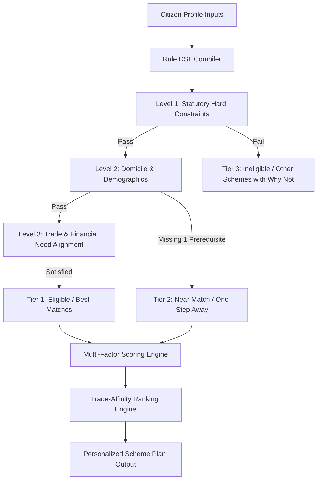

# UdyamSetu — Deterministic Eligibility & Ranking Engine

This document details the mathematical formulation, rule domain-specific language (DSL), scoring algorithms, and ranking pipeline that power **UdyamSetu's** eligibility determination.

---

## 1. Engine Philosophy

Unlike black-box generative models that produce probabilistic guesses, government welfare and financial subsidy decisions must adhere to **statutory determinism**:

```
CITIZEN PROFILE + STATUTORY RULES → DETERMINISTIC EVALUATION → EXPLAINABLE RESULT
```

Every qualification decision is backed by:
1. An immutable boolean evaluation of statutory rules.
2. A transparent audit trail of passed and failed conditions.
3. Explicit "Why Matched" signals or "Gap Analysis" detailing the single missing prerequisite.

---

## 2. Three-Tier Evaluation Pipeline



---

## 3. Statutory Rule DSL (Domain-Specific Language)

Schemes in UdyamSetu are compiled with structured statutory constraints:

| Rule Type | Field Evaluated | Example Constraint | Evaluation Logic |
| :--- | :--- | :--- | :--- |
| `AGE_RANGE` | `profile.age` | `min_age: 18, max_age: 35` | $18 \le \text{age} \le 35$ |
| `STATE_MATCH` | `profile.location_state` | `target_states: ["Uttar Pradesh"]` | Central scheme OR state in target list |
| `RESIDENCE_TYPE`| `profile.residence_type` | `residence: "rural"` | Rural unlocks 35% subsidy tier under PMEGP |
| `GENDER_QUOTA` | `profile.gender` | `genders: ["female"]` | Female grants access to Stand-Up India |
| `CATEGORY_QUOTA`| `profile.social_category`| `categories: ["SC", "ST", "OBC"]` | Affirmative action subsidy enhancement |
| `STAGE_FIT` | `profile.business_stage` | `stages: ["new"]` | Greenfield requirement |
| `SECTOR_FIT` | `profile.business_type` | `sectors: ["Textile", "Handicraft"]`| Priority trade multiplier |
| `UDYAM_MANDATE`| `profile.has_udyam` | `required: true` | Flags 5-minute online registration gap |

---

## 4. Multi-Factor Scoring Formula

For eligible and near-match schemes, relevance score $S \in [0, 100]$ is computed as:

$$S = w_{\text{statutory}} \cdot C_{\text{statutory}} + w_{\text{trade}} \cdot C_{\text{trade}} + w_{\text{stage}} \cdot C_{\text{stage}} + w_{\text{need}} \cdot C_{\text{need}} + w_{\text{subsidy}} \cdot C_{\text{subsidy}}$$

Where:
- $C_{\text{statutory}}$: Base qualification score (100 for eligible, 65 for near match).
- $C_{\text{trade}}$: Sector alignment between profile trade and scheme objectives.
- $C_{\text{stage}}$: Compatibility with greenfield vs. expansion stage.
- $C_{\text{need}}$: Overlap between citizen's requested assistance (`Loan`, `Subsidy`, `Machinery`) and scheme offerings.
- $C_{\text{subsidy}}$: Value density multiplier based on non-repayable grant percentage.

---

## 5. Result Classifications

### 5.1 Tier 1: Eligible (Best Matches)
- 100% of hard statutory criteria satisfied.
- Ranked in descending order of relevance score.
- Displays **"Why this is your best match"** positive green badges.

### 5.2 Tier 2: Near Match (One Step Away)
- The citizen satisfies primary demographics, but is missing exactly **one actionable requirement** (e.g., obtaining an Udyam registration number or having a project report prepared).
- Surfaces a dedicated **"Gap Analysis"** callout detailing:
  - Missing condition.
  - Action required.
  - Estimated time to fulfill.
  - Direct portal link to complete the requirement.

### 5.3 Tier 3: Ineligible (Other Evaluated Schemes)
- Schemes where statutory conditions (such as state domicile or age ceiling) cannot be met.
- **Never hidden silently**: Available under a collapsible accordion detailing exact reasons why the profile was disqualified and presenting alternative suggestions.

---

## 6. Real-Time Explainability Trace

When the citizen requests **"Explain Decision Trail"**, the engine generates an animated 7-step evaluation transcript:
1. Verification of age and applicant persona.
2. Domicile and regional jurisdiction check.
3. Affirmative demographic and quota verification.
4. Trade and industrial sector alignment.
5. Financial need compatibility.
6. SHA-256 evidence integrity check against official circulars.
7. Multi-factor relevance calculation.
